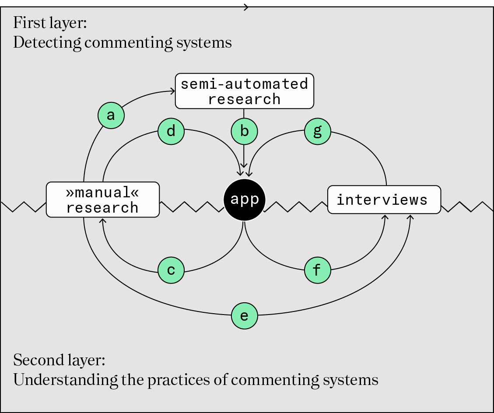

# Historische Technografie des Online-Kommentars

## Project description

The project researches the history of online commenting since the early 1990s. It develops and uses tools to sample data from the Internet Archive and conducts interviews with producers, users and other web actors that can help to reconstruct a transformation of practices and technologies of online commenting. The project examines three popularization dynamics within that context:

- The (semi-) automation of text production, quantitative rankings and community management,
- the aestheticization of quantities, activities and text-paratext relations and
- the platformization of commenting systems and the resulting oligopolies.

This is research project is part of the CRC Transformation of the Popular. The website of the project can be found [here](https://sfb1472.uni-siegen.de/forschung/popularisierung/historische-technografie-des-online-kommentars), including all publications.

## Research approach - visualised

This figure illustrates the research approach of detecting commenting systems and understanding the practices of them. This is achieved by combining semi-automated research, »manual« search and interviews with an app as a central hub app in this research architecture.

## App

The app is used for:
- displaying the results from the automated research (b)
- informing qualitative research about the gaps in the data (c)
- offers an interface to add findings from qualitative research and interviews (d, g)
- enables to raise questions to be asked in the interviews (f)

It uses the [shiny framework](https://shiny.rstudio.com/) for creating web applications written in R. The code is stored in the `shiny` folder of this repository. 

Access the app via [this link](https://shiny.sfb1472.uni-siegen.de/b03-technograph/).

## Data

The data provider is the internet archive, which supplied a dump of news websites that were analyzed in the project.

For copyright reasons, the html pages are not made available for download. Instead, index tables are published here showing which pages were analyzed.

We divide the web pages into three parts, which we call webspheres. We provide an index file for every websphere:

[International english written news sites](data/index/world-analysed-sites.csv)

[News sites dutch speaking](data/index/nl-analysed-sites.csv)

[News sites german speaking](data/index/de-analysed-sites.csv)

The files contain information the crawl date, the archive link and an md5 hash. An example:

crawl_date | archive_link | md5
-----------|--------------|-----
20170110 | http://web.archive.org/web/20170110/http://www.zerohedge.com/news/2016-02-28/ukraine-collapse-now-immanent | 0c51a4ec380d78f3a897635bfe94fc6d

